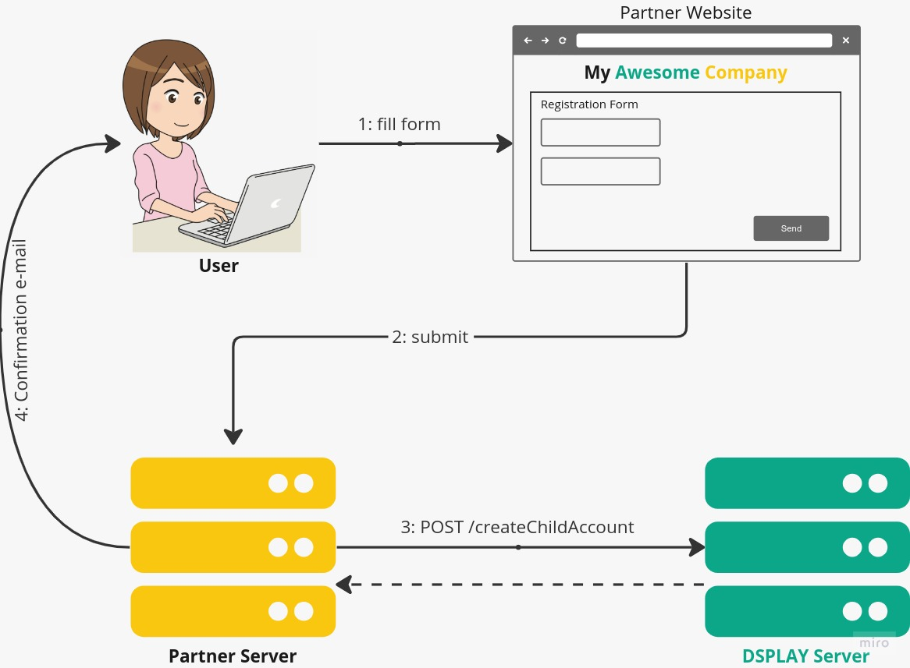

# Custom Registration

As an official DSPLAY partner, you can register child accounts straight from your own website. In this way, the child account is immediatelly attached to yours.

## Custom Registration Flow



>**IMPORTANT!**
>
>The `/createChildAccount` request have to be ALWAYS DONE FROM A BACK-END service because the `projectKey` cannot be exposed on the UI. 

## Endpoint URL

If you are an official DSPLAY partner you can see in your project info view the URL you can use to register child accounts.

The URL format is like this:
```
https://manager.dsplay.tv/project/createChildAccount/<your_project_key>
```

## Request

### Headers

- **`Accept-Language`**
  - description: The language you want to use to get the validation error messages.
  - required: `false`
  - The current supported values are `en_us` (default) and `pt_br`


### Example

You must send an `HTTP POST` request like the following:

```json
{
  "company": {
    "name": "A Child Account",
    "website": "https://achildaccount.com",
    "phone": "+55 11 111 111 111",
    "email": "main@achildaccount.com",
    "address": {
      "address": "Some Street",
      "number": "100b",
      "city": "Some City",
      "state": "Some State",
      "countryCode": "br",
      "postalCode": "11111-111"
    }
  },
  "billingInfo": {
    "accountType": "personal|business",
    "birthDate": "1980-01-01T00:00:00Z",
    "taxId": "<your tax id>",
    "email": "main@myawesomecompany.com",
    "phone": "+55 22 222 222 222",
    "address": {
      "address": "Another Address",
      "number": "5",
      "city": "Another City",
      "state": "Another State",
      "countryCode": "br",
      "postalCode": "22222-222"
    },
    "payment": {
      "method": "bank-slip|booklet|payment-link|subscription|credit-card|bank-transfer",
      "frequency": 12,
      "day": 1,
      "withholdingPct": 0
    }
  },
  "user": {
    "name": "Child Company's Main User Name",
    "email": "manager@achildaccount.com",
    "username": "manager",
    "password": "v3ry5tr0ngp455w0rd"
  },
  "settings": {
    "timezone": "America/Recife",
    "theme": "dsplay-light-neutral",
    "maxTerminals": 10,
    "quota": 1024,
    "active": true,
    "evaluationPeriodDays": 15,
    "qrCodesEnabled": true,
    "terminalStatusNotificationEnabled": false
  }
}
```

### Parameters

- **`company`** (`object`)
  - `name` (`string`)
    - required: `true`
    - description: The name of the new account.
  - `website` (`string`)
    - required: `true`
    - description: The company's website.
  - `phone` (`string`)
    - required: `true`
    - description: The company's phone.
  - `email` (`string`)
    - required: `true`
    - description: The company's main e-mail.
  - `address` (`object`)
    - `address` (`string`)
      - required: `true`
      - description: The company's address.
    - `number` (`string`)
      - required: `true`
      - description: The company's address number.
    - `city` (`string`)
      - required: `true`
      - description: The company's address city.
    - `state` (`string`)
      - required: `true`
      - description: The company's state.
    - `countryCode` (`string`)
      - required: `true`
      - description: The company's country code. It must be a valid [ISO-3166 2-alpha](https://en.wikipedia.org/wiki/ISO_3166-1_alpha-2#Officially_assigned_code_elements) country code
    - `postalCode` (`string`)
      - required: `true`
      - description: The company's postal code.
- **`billingInfo`** (`object`)
  - `accountType` (`string`)
    - required: `true`
    - description: The account type. Valid values are `personal` or `business`.
  - `birthDate` (`string`)
    - required: `true` for `personal` account type
    - description: The account holder birth date. Must be in [ISO-8601](https://en.wikipedia.org/wiki/ISO_8601) format.
  - `taxId` (`string`)
    - required: `true`
    - description: The account tax ID.
  - `email` (`string`)
    - description: The billing e-mail in case it differs of the company's one.
    - default: `company.email`
  - `phone` (`string`)
    - description: The billing phone in case it differs of the company's one.
    - default: `company.phone`
  - `address` (`object`)
    - `address` (`string`)
      - description: The billing address in case it differs of the company's one.
    - `number` (`string`)
      - description: The billing address number in case it differs of the company's one.
    - `city` (`string`)
      - description: The billing address city in case it differs of the company's one.
    - `state` (`string`)
      - description: The billing address state code in case it differs of the company's one.
    - `countryCode` (`string`)
      - description: The billing address country code in case it differs of the company's one. It must be a valid [ISO-3166 2-alpha](https://en.wikipedia.org/wiki/ISO_3166-1_alpha-2#Officially_assigned_code_elements) country code
    - `postalCode` (`string`)
      - description: The billing address postal code in case it differs of the company's one
  - `payment` (`object`)
    - `method` (`string`)
      - required: `true`
      - description: The preferred payment mnethod. Valid values are: `bank-slip`, `booklet`, `payment-link`, `subscription`, `credit-card` or `bank-transfer`
    - `frequency` (`float`)
      - required: `true`
      - description: The number of invoices this customer will receive per year. Some examples: 
        - `0.5`means 2-yearly invoice
        - `1` means yearly invoice
        - `3` means quarterly invoice and so one
        - `6` means biannual invoice
        - `12` means monthly invoice
    - `day` (`integer`)
      - required: `true`
      - description: The preferred day for payment.
    - `withholdingPct` (`float`)
      - required: `true`
      - description: The percentage of withholding on the source.
  - **`user`** (`object`)
    - `name` (`string`)
      - required: `true`
      - description: The name of the child company account's main user.
    - `email` (`string`)
      - required: `true`
      - description: The e-mail of the child company account's main user.
    - `username` (`string`)
      - required: `true`
      - description: The username of the child company account's main user.
    - `password` (`string`)
      - required: `true`
      - description: The password of the child company account's main user.
  - **`settings`** (`object`)
    - `timezone` (`string`)
      - required: `true`
      - description: The value must be a valid [Unix Timezone]().
    - `theme` (`string`)
      - required: `true`
      - description: The account's UI theme. Valid values are: `dsplay-light`, `dsplay-neutral-light`, `dsplay-dark` or `classic`.
      - default: DSPLAY Partner's theme will applied automatically to they children of none is specified
    - `maxTerminals` (`integer`)
      - required: `true`
      - description: The maximum number of terminals the child account is able to activate. You can pass `null` for unlimited.
    - `quota` (`integer`)
      - required: `true`
      - description: The maximum storage space (in bytes) the child account is able to use. You can pass `null` for unlimited.
    - `active` (`boolean`)
      - required: `true`
      - description: If the child account will be active or not after it's creation.
    - `evaluationPeriodDays` (`integer`)
      - required: `true`
      - description: The evaluation period (in days) of the child account.
    - `qrCodesEnabled` (`boolean`)
      - required: `true`
      - description: If the child account has QR Codes functionality enabled.
    - `terminalStatusNotificationEnabled` (`boolean`)
      - required: `true`
      - description: If the child account has terminal status notifications enabled.


## Response

### Success Example

```json
{
  "status": 200,
  "data": {
    "parent": {
      "id": "1",
      "name": "My Awesome Company"
    },
    "project": {
      "name": "A Child Account",
      "id": 19,
      "key": "7c08662f0eeb0946801b24dc999b4714e1810f99b4871601c49e51de82a9865d",
      "address": {
        "address": "Some Street",
        "number": "100b",
        "city": "Some City",
        "state": "Some State",
        "countryCode": "br",
        "country": "Brazil",
        "postalCode": "11111-111"
      },
      
      "creation": "2023-05-31T00:00:00+00:00",
      "expiration": "2023-06-18T00:00:00+00:00",
      "active": true,
      "evaluation": true,
      "qrCodesEnabled": true,
      "theme": "dsplay-light-neutral",
      "parentId": "1",
      "maxTerminals": 10,
      "quota": 1024,
      "terminalStatusNotificationEnabled": true,
      "links": [
        "http:\/\/ds.myawesomecompany.com\/project\/19",
        "https:\/\/manager.dsplay.tv\/project\/19"
      ]
    },
    "billingInfo": {
      "accountType": "personal",
      "taxId": "<your tax id>",
      "email": "main@achildaccount.com",
      "phone": "+55 22 222 222 222",
      "address": {
        "address": "Another Address",
        "number": "5",
        "city": "Another City",
        "state": "Another State",
        "countryCode": "br",
        "country": "Brazil",
        "postalCode": "22222-222",
      },
      "payment": {
        "method": "bank-slip",
        "frequency": 12,
        "day": 1,
        "withholdingPct": 0
      }
    },
    "user": {
      "id": 25,
      "name": "Child Company's Main User Name",
      "email": "manager@achildaccount.com",
      "username": "manager",
      "registration": "2023-05-31T00:00:00+00:00",
      "active": false,
      "activationCode": "64775e8f5b989",
      "activationLinks": [
        "http:\/\/ds.myawesomecompany.com\/user\/activate?email=manager%40achildaccount.com&activationCode=64775e8f5b989",
        "https:\/\/manager.dsplay.tv\/user\/activate?email=manager%40achildaccount.com&activationCode=64775e8f5b989"
      ]
    }
  }
}
```

### Error Example

```json
{
  "status": 400,
  "message": "Validation errors",
  "errors": {
    "user": {
      "username": [
        "Username already taken"
      ],
      "email": [
        "E-mail already taken"
      ]
    }
  }
}
```